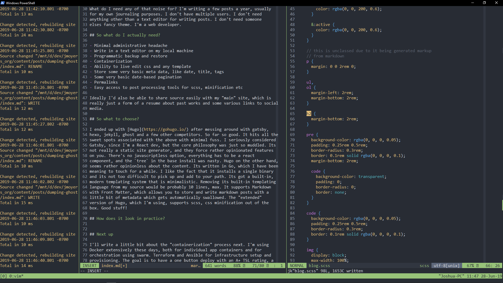

Coming back to my personal site after a few years has traditionally been a
painful process of trying to figure out how things are glued together. Prior to
my introduction to containerization and infrastructure as code, typically for my
own personal site, I've been very ad-hoc about adminitstration. I manually set
up a digital ocean droplet, select an operating system, install packages, modify
systemd, install a package or two, including my own codebase and forget about
it.

What this means in practice is that software gets out of date. Specifically,
node packages. In node land, 3 years is essentially a lifetime. Ghost went
through two major releases. I came back and my import/export json file wouldn't
even load into the latest version. I hate wasting time on stuff like this.

I started to containerize everything. I'm fiddling around with sqlite database,
admin users and all manner of garbage. The templating system is archaic already
and based on mustache with no nice way to integrate with modern post processing
tools. Live reload isn't built in. You have to jump through hoops to automated
database backup and restore.

## Why am I putting up with this?

What do I need any of that noise for? I'm writing a few posts a year, usually
for my own journaling purposes. I don't have multiple users. I don't need
anything other than a text editor for writing posts. I don't need someone
elses fancy theme. I'm a web developer.

## So what do I actually need?

- Minimal administrative headache
- Write in a text editor on my local machine
- Programmatic backup and restore
- Containerization
- Ability to live edit css and any template
- Store some very basic meta data, like date, title, tags
- Some very basic date-based pagination
- Permalinks
- Easy access to post processing tools for scss, minification etc

Ideally I'd also be able to share source easily with my "main" site, which is
really just a form of a resume about past works and some various links to social
media.

## So what to choose?

I ended up with [Hugo](https://gohugo.io/) after messing around with gatsby,
hexo, jekyll, ghost and a few other competitors. So far so good. It hits all the
sweet spots associated with the above with minimal fuss. I seriously considered
Gatsby, since I'm a React dev, but the core philosophy was just so muddled. Its
not really a static site generator, and they force rather opinionated features
on you. There's no javascriptless option, everything has to be a react
component, and the `tree` in the base install was nasty. Hugo on the other hand,
seems rather opinionless about the content. Its written in Go, which I have been
meaning to touch for a while. I like the fact that it installs a single binary
and its not too difficult to pick up and add to your path. Its got a built-in,
modern templating system that is minimalistic. Removing its built-in templating
language from my source would be probably 10 lines, max. It supports Markdown
with Front Matter, which allows you to store and write markdown posts with a
little bit of metadata which gets automatically swallowed. The "extended"
version of Hugo, which I'm using, supports scss, css minification out of the
box. Good stuff!

## How does it look in practice?

- 3 tmux panes - `hugo server` | `vim dumping-ghost/index.md` | `vim theme.scss`
- Hitting `:w` results in a browser reload, even on WSL for windows, which I am
  using. Typically filewatching on windows is dicey at best.
- Instantly build a minified css file from a few scss files
- When I want to post this, I just rebuild my container and deploy through an
  ansible playbook.

Happy!

## Next up

I'll write a little bit about the containerization process next. I'm using
Docker extensively these days, both for individual app containers and for
orchestration using swarm. Terraform and Ansible for infrastructure setup and
provisioning. The goal is to have a one button deploy with an A+ TSL rating, a
running nginx and hugo server on a single node swarm using docker.
