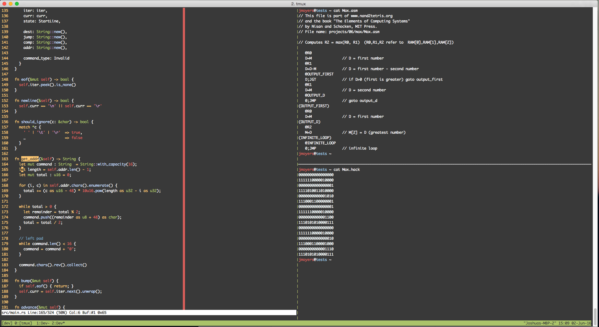

If you are currently in a anti-IDE frame of mind (which I cycle into from time
to time), tmux can be a useful way to use vim and also retain the ability to
look at several pieces of output ...

1. without a bunch of floating terminal windows
2. hitting C-z and typing fg over and over.

**Current Setup** 

I went through a period on intense tool customization, but I find it pretty hard
to pick back up on all the little customizations if I walk away from a toolset
for a while. I've since been wary of keeping too many dotfiles. However, a few
lines aint so bad.

**Minimum Customization?**

- Changing `M-b` (the prefix for any tmux shortcut) to something that isn't in
  the dead center of the keyboard **ლ(ಠ 益 ಠლ)**. I chose `M-a`
- Re-run the last command in my 'compile' pane, which is usually something like
  `gcc [unholy list of options]` or `cargo run [unholy list of options]`. If you
  have a compile/watch system like gulp and watchify in the node world, not
  required!

And so here we are `.tmux.conf`



Lastly, as a bonus, I put together a shell script to open tmux with 3 panes and
run vim. Completely optional, but also sort of useful if you reboot or kill the
session.


