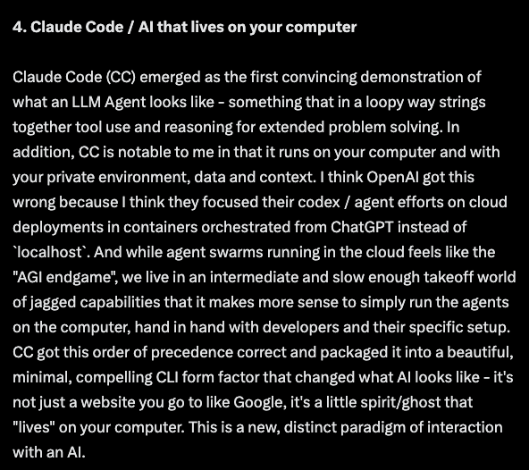

Andrej Karpathy posted an incredible 2025 LLM Year in Review. It is a totally
salient take (obviously, he's brilliant!) and mirrors a lot of my experiences in
the trenches. I have a slightly different take on a point or two below.

⪼ Like Karpathy, I believe there is a ton of value for the application layer
above LLMs. I think the model providers are making a generally useful brain, but
its frozen in a moment and for now at least, we need prompt and context
engineering, specialized tools, and verification for producing repeatably good
results. Agents need access to platforms that have tools built-to-purpose for a
given domain. For coding: think semantic indexing over codebases and semantic
browser-use APIs, debugging techniques optimized for machines, and
unit/integration/end-to-end tests. And its true for basically every specialized
domain - including environmental! Think about a human without any long term
memory and only a few pieces of paper on which to record your thoughts - you'd
get extremely creative "compressing" the important ideas down, but eventually
you're going to start repeating the mistakes of the past.

⪼ On vibe coding, I only take issue with one point here: "regular people benefit
a lot more from LLMs compared to professionals, corporations and governments."
In my experience, the people that benefit the most are both very experienced and
also very cross-functional (see: [Foxes and Hedgehogs](/posts/foxes/)) - I think
its a bimodal distribution. I think if your problem is solved by throw-away
software or analysis, LLMs absolute change the entire calculus of whats
possible. If your problem is bigger or more systemic than an individual
contributor can solve on their machine, it still requires an experienced hand to
get good results, and if you experienced hand is also cross functional (has good
design sense, product ownership, dips into industry-specific domain knowledge
deeply) you get absolutely outsized results. As to why we aren't seeing huge
impact on the rest of the economy vs. what we're seeing in coding, I think its
related to point 1. We are very slowly building domain specific tools (outside
of coding) and most products have not let go of their pure SaaS mindset yet.
2026 is going to bring way more of this, and I think the impact on the economy
will start to accelerate.

⪼ On "AI that lives on your computer" or more specifically why coding agents are
best when they are local to the developer's machine: I agree with Andrej's take
broadly, but I actually think this is solvable just inside the "tools layer." We
need a new focus on repeatable dev setup - local databases, test API keys or
mocked third party services, enough compute to run automated tests including
browser automation like Playwright. Isolated test datasets that don't interact
with each other so they can be run in parallel. Without the verification layer
reproduced inside a container and more rigorous verification and adversarial
prompting, you can't actually get the results you need. You get half baked PRs
that have compile issues and have not actually run tests or verified their
results - and thats where almost _all_ of the magic takes place. So a developer
ends up having to review and intervene anyway. Ergo, its just better to be local
to have a faster devx feedback loop. You might argue thats fragile enough that
we'll see local development continue to dominate, but I think there's a pretty
strong incentive for us to focus on solving for. Smart models operate in 15 - 25
minute increments, and we should be able to have multiple threads running. The
same things that make "worktrees" work make cloud-based development work - solve
for both.

Andrej is an incredible educator, and he sheds light in a special way. He's a
rare individual that combines deep understanding with the ability to communicate
complex ideas simply.

[View Karpathy's original post on X](https://x.com/karpathy/status/2002118205729562949)

  
  

